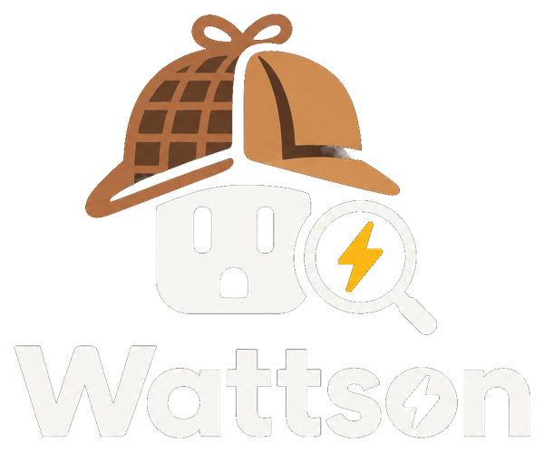

# Wattson

*The power detective for Home Assistant.*

Home Assistant already tells you **how much** power you use. Wattson tells you **who** and **when to act**:

- a **traffic light** (`sensor.wattson_semaforo`: go / wait / stop) that warns you before a heavy load trips your meter, and names what is on;
- **fingerprints**: it learns your appliances by themselves from the main meter alone, and better with every metering plug you add;
- the **night base load**, a **weekly summary** in kWh and €, and optional sharing of measured appliances with a public [catalog](https://github.com/tlabcustomaudio/wattson-catalog).

Local only: no cloud, no account (GitHub only if you choose to share with the catalog).

## Install

1. HACS → *Integrations* → ⋮ → **Custom repositories** → this repository's URL, category *Integration* → **Download**.
2. Restart Home Assistant.
3. Settings → Devices & services → **Add integration** → **Wattson**, and answer four questions.

A **Wattson** dashboard appears in the sidebar within a minute. Everything else, step by step: **[MANUAL.md](MANUAL.md)**.

## License

Free for personal and other noncommercial use: you can use it, study it, fix it and share your fixes. Selling it or using it for a commercial purpose needs permission. Full terms: [PolyForm Noncommercial 1.0.0](LICENSE.md).

Bug reports and fixes are welcome as issues and pull requests.
